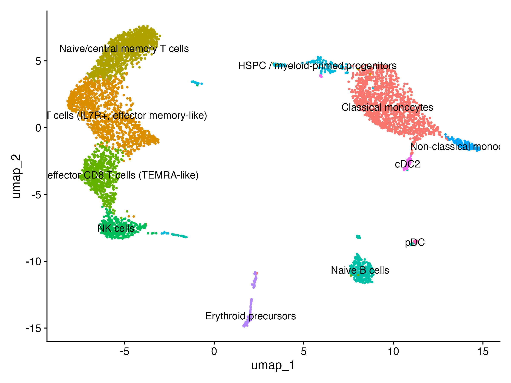
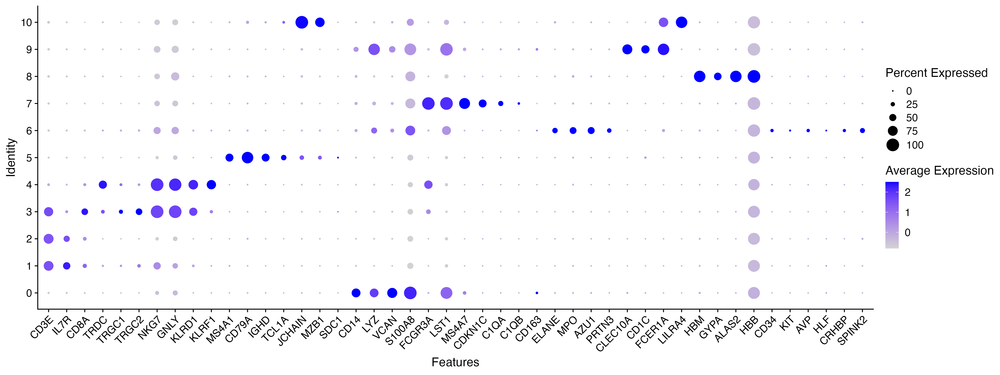

# Single-cell RNA-seq of human bone marrow

Analysis of a public 10x Genomics bone marrow dataset with Seurat v5: quality control, clustering, marker gene detection and manual annotation of the cell populations.



## Dataset

| | |
|---|---|
| Source | [PanglaoDB](https://panglaodb.se/view_data.php?sra=SRA779509&srs=SRS3805259); deposited in GEO as part of series GSE120221 |
| Accessions | SRA779509, SRS3805259 (run SRR7881413), GEO sample GSM3396175 |
| Sample | Bone marrow mononuclear cells (Ficoll-isolated, cryopreserved) from one healthy volunteer, *Homo sapiens*, 50 years old |
| Technology | 10x Chromium, Illumina HiSeq 3000 |
| Cells | 6,032 in the PanglaoDB matrix; 5666 after QC |

The sample is one of the 20 healthy donors of Oetjen et al., JCI Insight 2018 (see References). That study analysed all donors together; this repository analyses this single donor on its own.

The count matrix is not included in this repository. Download the "R data" file for this sample from PanglaoDB and save it as `data/SRA779509_SRS3805259.sparse.RData`. It contains a sparse matrix called `sm` (genes x cells).

## Workflow

The whole analysis is in `scripts/01_scRNAseq_bone_marrow.R`.

1. **Quality control.** Cells with 250 to 2500 detected genes and less than 10% mitochondrial reads were kept. The thresholds were set from the distributions before filtering (`results/figures/01_qc_violin_before.png`, `02b_qc_scatter_thresholds.png`):
   - high mitochondrial fractions occur almost only in cells with low UMI counts, and 10% marks the end of the main body of the distribution;
   - the lower gene cutoff is low on purpose, because erythroid cells have few detected genes (haemoglobin dominates their counts);
   - the upper gene cutoff sits at the edge of the dense cloud of cells and removes the sparse tail above it, which is mostly outliers and likely doublets. The median is about 900 genes per cell.

   The original study kept cells with at least 500 genes and less than 8% mitochondrial reads. The lower gene cutoff used here (250) is lower on purpose, to retain the low-complexity erythroid cells.
2. **Normalisation.** Log-normalisation (scale factor 10,000), 2,000 variable genes (vst), scaling of all genes. Cell cycle phase was scored but not regressed out.
3. **Dimensionality reduction and clustering.** PCA, first 20 PCs (elbow plot), shared nearest neighbour graph, clustering at resolution 0.5 (11 clusters, 0 to 10), UMAP on the same 20 PCs.
4. **Markers.** `FindAllMarkers` (positive markers, min.pct 0.25, log2FC threshold 0.25). Top 10 genes per cluster were ranked both by log2FC and by the difference in detection rate inside versus outside the cluster.
5. **Annotation.** Done manually from the marker tables, a dot plot of canonical lineage markers, and pairwise contrasts between related clusters (1 vs 2, 1 vs 3, 3 vs 4).

## Results

| Cluster | Cell type | Main supporting genes |
|---|---|---|
| 0 | Classical monocytes | CD14, VCAN, S100A8/9/12, FCN1, CSF3R |
| 1 | Memory T cells (IL7R+, effector memory-like) | CD3D/E, TRAC, IL7R, S100A4, CD69; higher GZMK, GZMA, CCL5, KLRG1 than cluster 2 |
| 2 | Naive/central memory T cells | CCR7, SELL, TCF7, LEF1, LTB |
| 3 | Cytotoxic effector CD8 T cells (TEMRA-like) | CD8A/B, GZMH, FGFBP2, GZMB, GNLY, ZNF683, KLRG1 |
| 4 | NK cells | KLRF1, KLRC1, SPON2, MYOM2, PRF1, no CD3 |
| 5 | Naive B cells | MS4A1, CD79A, IGHM, IGHD, TCL1A |
| 6 | HSPC / myeloid-primed progenitors | ELANE, MPO, AZU1, PRTN3, SPINK2, PRSS57 |
| 7 | Non-classical monocytes | FCGR3A, CDKN1C, HES4, MS4A7, SIGLEC10 |
| 8 | Erythroid precursors | HBM, ALAS2, GYPA, SLC4A1, FECH |
| 9 | cDC2 | CD1C, CLEC10A, FCER1A, HLA-DQA1 |
| 10 | pDC | LILRA4, CLEC4C, IL3RA, SCT, IRF8 |

Cell numbers per population are in `results/tables/cell_type_counts.csv`.



## Limitations

- Only the mononuclear fraction of the aspirate was sequenced (Ficoll separation, then cryopreservation), so mature granulocytes are absent by design and the cell proportions do not represent whole bone marrow.
- Droplet-based scRNA-seq separates NK cells from CD8 effector T cells poorly because their transcriptional programmes overlap; the original study reports a bias in T and NK frequencies against flow and mass cytometry. Clusters 3 and 4 here should be read with this in mind.
- One sample from one donor: no replicates, so no batch or donor effects can be assessed. P-values from the cluster contrasts treat cells as independent and are inflated; the tables should be read through log2FC and detection rates.
- CD4 is barely detected in this dataset, so the CD4/CD8 identity of clusters 1 and 2 is not resolved (cluster 1 is probably a mixture).
- Cluster 1 has a stronger activation/immediate-early signature (DUSP2, JUNB, DNAJB1, CD69) than the other clusters, and part of it could be technical. The classical heat-shock genes (HSPA1A/B) are not elevated, so it does not look like a generic dissociation artefact.
- Cluster 6 contains only a small minority of cells expressing HSC markers (CD34, KIT, AVP, HLF), so it is not annotated as a stem cell cluster.
- The automatic annotation on PanglaoDB lists plasma cells and gamma delta T cells for this sample. I did not find a plasma cell cluster (SDC1 not detected, JCHAIN and MZB1 mostly in the pDC cluster), and TRDC was highest in the NK cluster rather than in the T clusters, so these labels were not adopted. Rare populations may be merged at this resolution.
- Doublets were only filtered with the upper gene threshold, not with a dedicated doublet detection tool.

## Reproducing the analysis

```r
# from the repository root, with the input file in data/
source("scripts/01_scRNAseq_bone_marrow.R")
```

Figures are written to `results/figures/`, tables to `results/tables/`, and the annotated Seurat object to `results/bone_annotated.rds` (not tracked because of its size). Package versions are in `results/sessionInfo.txt`. Requires R and Seurat >= 5.0.0, plus dplyr, ggplot2 and patchwork.

## Repository structure

```
scripts/01_scRNAseq_bone_marrow.R
results/figures/                      QC, UMAP and dot plots
results/tables/                       markers, contrasts, cell counts
results/sessionInfo.txt
```

## References

- Oetjen KA, Lindblad KE, Goswami M, Gui G, Dagur PK, Lai C, Dillon LW, McCoy JP, Hourigan CS. Human bone marrow assessment by single-cell RNA sequencing, mass cytometry, and flow cytometry. *JCI Insight* 2018;3(23):e124928. https://doi.org/10.1172/jci.insight.124928
- Franzén O, Gan LM, Björkegren JLM. PanglaoDB: a web server for exploration of mouse and human single-cell RNA sequencing data. *Database* 2019, baz046.
- Hao Y, et al. Dictionary learning for integrative, multimodal and scalable single-cell analysis. *Nature Biotechnology* 2024.
